# 🍎 NutriScan AI - Intelligent Nutritional Analyzer

A web application for nutritional analysis using computer vision, RAG, and AI agents to identify food products and suggest healthier alternatives.

---

## 🎯 Overview

Upload a product photo → Automatic nutritional analysis → Healthy alternative suggestions

**Key Technologies:** Vision AI • RAG (ChromaDB) • LangChain Agents • Flask

---

## 📊 Global Architecture

```mermaid
graph TB
    IMG[📸 Product Image] --> VISION[🔍 Vision AI<br/>Product Detection]
    VISION --> AGENT[🤖 Agent]
    
    AGENT --> LOCAL[💾 Local RAG Base<br/>500+ products]
    AGENT --> WEB[🌐 Web Search<br/>Fallback]
    
    LOCAL --> LLM[🧠 LLM Analysis]
    WEB --> LLM
    
    LLM --> RESULT[✅ Nutritional Analysis<br/>+ Alternatives]
```



---

## 🗃️ Data Pipeline - Cleaning and Preparation

### Source: Open Food Facts

Data comes from **[Open Food Facts](https://fr.openfoodfacts.org/)**, a collaborative global database containing millions of food products. The dataset is downloadable in Parquet format (an optimized file format for large data volumes).

**Initial Problem:** The raw file contains millions of products worldwide, with lots of missing data, poorly formatted, or useless for our use case.

```mermaid
graph LR
    A[📦 Open Food Facts<br/>Millions of products<br/>Raw data] --> B[🔧 Polars Cleaning<br/>Filtering + Transformation]
    B --> C[📝 RAG Formatting<br/>Descriptive text creation]
    C --> D[🧮 Embeddings<br/>Vector transformation]
    D --> E[(💾 ChromaDB<br/>Vector database<br/>500+ clean products)]
```



### Why Use Polars?

**Polars** is an ultra-fast Python library for data manipulation (alternative to Pandas).

**Polars advantages for our project:**
- **Speed**: 10x faster than Pandas on large files
- **Lazy evaluation**: Only loads data at the last moment (saves RAM)
- **Modern API**: More readable code with chained methods

### Raw Dataset Challenges

The `food.parquet` file from Open Food Facts contains **complex structures** that are difficult to manipulate:

#### Challenge 1: Multilingual Product Names

```python
# Real structure in the file
product_name = [
    {"lang": "en", "text": "Chocolate spread"},
    {"lang": "fr", "text": "Pâte à tartiner au chocolat"},
    {"lang": "de", "text": "Schokoladenaufstrich"}
]
```

**Difficulty:** The name isn't simple text, but a **list of dictionaries**. We need to extract only the French version.

#### Challenge 2: Brand Tags with Prefixes

```python
# Real structure
brands_tags = ["xx:ferrero", "en:nutella-brand"]
```

**Difficulty:** Brands have language prefixes (`xx:`, `en:`). We need to clean them and take only the first element.

#### Challenge 3: Nested Nutrients in JSON

```python
# Real structure
nutriments = [
    {"name": "energy-kcal", "100g": 539.0},
    {"name": "fat", "100g": 30.9},
    {"name": "saturated-fat", "100g": 10.6},
    ...
]
```

**Difficulty:** Nutritional values are in a **list of nested dictionaries**. We need to extract them one by one and transform them into flat columns.

### Detailed Cleaning Steps (`load_data.py`)

#### Step 1: Loading with Lazy Evaluation

```python
df_france = pl.scan_parquet("food.parquet")  # Does NOT load data yet
```

**Explanation:** `scan_parquet` creates an "execution plan" without loading data into memory. It's like preparing a recipe before cooking. Polars optimizes everything and only loads what's necessary.

#### Step 2: Intelligent Filtering with Chaining

```python
df_france = (
    pl.scan_parquet("food.parquet")
    .filter(
        (pl.col("countries_tags").list.contains("en:france")) &  # Products sold in France
        (pl.col("product_name").list.len() > 0) &                # Name present
        (pl.col("brands_tags").is_not_null()) &                  # Brand present
        (pl.col("nutriments").is_not_null()) &                   # Nutrients present
        (pl.col("brands_tags").list.len() > 0)                   # At least 1 brand
    )
    .select(["product_name", "brands_tags", "nutriments"])       # Column selection
    .collect()  # ONLY HERE we load into memory
)
```

**Chaining explanation:**
- Each `.filter()` or `.select()` adds an operation to the plan
- `.collect()` executes EVERYTHING at once in an optimized way
- We go from millions of rows to a few thousand

**What's filtered:**
- ❌ Products sold outside France
- ❌ Products without name
- ❌ Products without brand
- ❌ Products without nutritional data

#### Step 3: Polars → Pandas Conversion

```python
df_france = df_france.to_pandas()
```

**Why Pandas after Polars?**
- Polars is excellent for filtering and loading
- Pandas is simpler for complex line-by-line transformations
- We use the best of each tool!

#### Step 4: French Name Extraction

```python
# Filter only products with French name
df_france = df_france[df_france.product_name.apply(
    lambda x: "fr" in [el["lang"] for el in x]
)]

# Extract French text
df_france["product_name"] = df_france.product_name.apply(
    lambda x: [el["text"] for el in x if el["lang"] == "fr"][0]
)
```

**Detailed explanation:**
1. For each product, we look at the name list
2. We verify a French version exists (`"fr"`)
3. We extract only the text of this version
4. Result: `"Pâte à tartiner au chocolat"` instead of a complicated list

#### Step 5: Brand Cleaning

```python
df_france["brand_tag"] = df_france.brands_tags.apply(
    lambda x: x[0].replace("-", " ").replace("xx:", "")
)
```

**Explanation:**
- Take the first element: `"xx:ferrero"`
- Remove the prefix: `"ferrero"`
- Replace dashes with spaces: `"ferrero"` → `"ferrero"`

#### Step 6: Nutrient Extraction (most complex part)

```python
def extract_nutrients(nutrient_list):
    """Transform a list of dicts into a simple dict"""
    nutrients = {}
    for item in nutrient_list:
        name = item['name']        # Ex: "fat"
        value_100g = item['100g']  # Ex: 30.9
        if name == 'energy':       # Ignore 'energy' (keep 'energy-kcal')
            continue
        nutrients[name] = value_100g
    return nutrients

# Apply to all rows
dfn = pd.DataFrame(df_france.nutriments.apply(extract_nutrients).to_list())
```

**Explanation:**
1. For each product, we have a list like:
   ```python
   [{"name": "fat", "100g": 30.9}, {"name": "sugars", "100g": 56.3}]
   ```
2. We transform it into a simple dictionary:
   ```python
   {"fat": 30.9, "sugars": 56.3}
   ```
3. Pandas automatically transforms the dictionary into columns:
   ```
   | fat  | sugars |
   |------|--------|
   | 30.9 | 56.3   |
   ```

#### Step 7: Key Nutrient Selection

```python
medium_coverage_nutrition_keys = [
    "energy-kcal",      # Energy in kilocalories
    "fat",              # Total fat (g/100g)
    "saturated-fat",    # Saturated fatty acids (g/100g)
    "carbohydrates",    # Total carbohydrates (g/100g)
    "sugars",           # Sugars (g/100g)
    "fiber",            # Dietary fiber (g/100g)
    "proteins",         # Proteins (g/100g)
    "salt"              # Salt (g/100g)
]

dfn = dfn[medium_coverage_nutrition_keys]  # Keep only these columns
```

**Why these 8 nutrients?**
- These are the most reliable and available values in Open Food Facts
- These are essential information to evaluate a product
- Other nutrients (vitamins, minerals) are too rarely documented

#### Step 8: Merge and Final Dataset Creation

```python
df_france = pd.concat([df_france, dfn], axis=1)
df_france = df_france[["product_name", "brand_tag"] + medium_coverage_nutrition_keys]
```

**Final result:** A clean dataframe with **10 columns**:

| product_name | brand_tag | energy-kcal | fat | saturated-fat | carbohydrates | sugars | fiber | proteins | salt |
|--------------|-----------|-------------|-----|---------------|---------------|--------|-------|----------|------|
| Nutella | ferrero | 539.0 | 30.9 | 10.6 | 57.5 | 56.3 | 0.0 | 6.3 | 0.107 |

#### Step 9: RAG Text Creation

```python
def create_full_rag_text(row):
    """Transform a row into a complete descriptive text"""
    return (
        f"Produit : {row['product_name']}. "
        f"Marque : {row['brand_tag']}. "
        f"Énergie : {row['energy-kcal']} kcal. "
        f"Matières grasses totales : {row['fat']} g, "
        f"dont acides gras saturés : {row['saturated-fat']} g. "
        f"Glucides : {row['carbohydrates']} g, "
        f"dont sucres : {row['sugars']} g. "
        f"Protéines : {row['proteins']} g. "
        f"Fibres alimentaires : {row['fiber']} g. "
        f"Sel : {row['salt']} g."
    )

df_france['text_for_rag'] = df_france.apply(create_full_rag_text, axis=1)
```

**Why create this text?**
- The embedding model (all-MiniLM-L6-v2) better understands natural sentences
- Numerical values alone don't give enough context
- This text will be transformed into a vector for semantic search

**Generated text example:**
```
"Produit : Nutella. Marque : ferrero. Énergie : 539 kcal. 
Matières grasses totales : 30.9 g, dont acides gras saturés : 10.6 g. 
Glucides : 57.5 g, dont sucres : 56.3 g. Protéines : 6.3 g. 
Fibres alimentaires : 0 g. Sel : 0.107 g."
```

#### Step 10: LangChain Document Creation

```python
documents = [
    Document(
        page_content=f"{row['product_name']} {row['brand_tag']}", 
        metadata=row.to_dict()  # All nutritional data
    ) for _, row in df_france.iterrows()
]
```

**Document structure explanation:**
- **`page_content`**: Text that will be transformed into a vector for search
  - Example: `"Nutella ferrero"`
  - This short text allows quickly finding the right product
- **`metadata`**: All complete product information
  - Example: `{"product_name": "Nutella", "fat": 30.9, "sugars": 56.3, ...}`
  - This data is returned when the product is found

**Why separate page_content and metadata?**
- Search is done on `page_content` (fast and precise)
- Complete nutritional details are in `metadata` (available after search)
- Better performance: we search on short text, we retrieve everything

#### Step 11: Embedding Generation and Storage

```python
embeddings = HuggingFaceEmbeddings(model_name="all-MiniLM-L6-v2")

vector_store = Chroma.from_documents(
    documents, 
    embeddings, 
    persist_directory="./chroma_db"
)
```

**Behind the scenes:**

1. **For each document** (500+ times):
   ```python
   text = "Nutella ferrero"
   vector = embeddings.embed(text)  # → [0.23, -0.45, 0.67, ..., 0.12]
   ```

2. **ChromaDB stores**:
   - The vector (384 numbers)
   - The original text
   - Complete metadata
   - An index for fast searching

3. **Persistent save**:
   - Everything is saved in `./chroma_db/`
   - No need to redo this step at each app launch
   - Instant reload in `app.py`

**Final dataset: 500+ products** with complete nutritional data and calculated vectors, ready for semantic search.

---

## 🔍 RAG Architecture (Retrieval-Augmented Generation)

RAG combines **two steps**:
1. **Retrieval**: Search for relevant information in a database
2. **Generation**: Use an LLM to create a response based on this information

**Why use RAG?**
- An LLM alone can "hallucinate" (invent information)
- RAG provides **reliable sources** to the LLM
- Responses are based on **real data** from our database

### Three-Phase Process


### Phase 1: Indexing (done once at startup)

**Objective:** Prepare our 500+ products to be searchable quickly

1. **Descriptive text creation**
   ```
   "Produit : Nutella. Marque : ferrero. 
   Énergie : 539 kcal. Matières grasses : 30.9g..."
   ```

2. **Vector transformation (embedding)**
   - Text is transformed into a list of 384 numbers
   - Simplified example: `[0.23, -0.45, 0.67, 0.12, ...]`
   - These numbers capture the **meaning** of the text
   - Similar texts have close vectors

3. **ChromaDB storage**
   - Each product is stored with its vector
   - ChromaDB creates an index to search quickly

### Phase 2: Search (when user searches for a product)

**Objective:** Find the most relevant products in milliseconds

1. **Question transformation into vector**
   - Question: "Nutella"
   - Vector: `[0.25, -0.43, 0.69, 0.11, ...]`
   - **Important**: We use the same model as for indexing

2. **Cosine similarity calculation**
   - We compare the question vector with all stored vectors
   - Mathematical formula that calculates the angle between two vectors
   - Smaller angle = more similar texts
   - Score between -1 and 1 (1 = identical, 0 = no relation)

3. **Top 3 retrieval**
   - We keep the 3 products with the best scores
   - Example:
     * Nutella (score: 0.95) ✅
     * Chocolate hazelnut spread (0.87) ✅
     * Chocolate powder (0.72) ✅

### Phase 3: Generation (response creation)

**Objective:** Use an LLM to analyze found data and generate a natural language response

1. **Enriched prompt construction**
   ```
   User question: Nutritional analysis of Nutella
   
   Found data:
   - Nutella: Energy 539 kcal, Fat 30.9g, Sugars 56.3g
   - Chocolate spread: Energy 520 kcal, Fat 28g, Sugars 54g
   
   Generate analysis in French...
   ```

2. **LLM processes everything**
   - It reads the question AND the data
   - It understands the context
   - It generates a coherent and accurate response

3. **Final response**
   ```
   "Nutella contains a high amount of sugars (56.3g/100g) 
   and fat (30.9g/100g). It's a very energetic product (539 kcal) 
   to be consumed in moderation..."
   ```

### RAG Advantages in Our Project

✅ **Accuracy**: Exact nutritional data (no hallucination)
✅ **Speed**: Vector search in <100ms
✅ **Contextual**: LLM understands the question thanks to data
✅ **Scalable**: Works with 500 or 50,000 products
✅ **Multilingual**: Embedding model understands multiple languages

---

## 🤖 Agent System - Detailed Explanation

An agent is a program that can **make decisions** and **use tools** to accomplish a task.

**Simple analogy:** Imagine an assistant searching for information for you:
- You ask them a question
- They decide where to search (local library or internet)
- They use the right tools
- They give you a synthesized answer

### Our Agent's Tools

Our agent has **2 tools**:

```mermaid
graph TD
    AGENT[🤖 Agent] --> TOOL1[🔧 Tool 1: search_local_db]
    AGENT --> TOOL2[🔧 Tool 2: search_web]
    
    TOOL1 --> DESC1[Search in our<br/>ChromaDB base<br/>500+ products]
    TOOL2 --> DESC2[Search on internet<br/>DuckDuckGo<br/>Fallback if base empty]
```



#### 🔧 Tool 1: `search_local_db(query)`

**Role:** Search in our local database (ChromaDB)

**How it works:**
1. Receives a query: "Nutella"
2. Uses RAG to search (see previous section)
3. Retrieves the 3 most similar products
4. Returns all nutritional information

**Return example:**
```python
"Product: Nutella ferrero
Metadata: {
  'energy-kcal': 539.0,
  'fat': 30.9,
  'saturated-fat': 10.6,
  'sugars': 56.3,
  'proteins': 6.3,
  ...
}"
```

#### 🔧 Tool 2: `search_web(query)`

**Role:** Search on internet as needed (fallback)

**How it works:**
1. Activated ONLY if local database finds nothing
2. Uses DuckDuckGo to search
3. Optimized query: "nutritional values [product] sugar fat"
4. Returns web results

**Usage example:**
```python
# If exotic product not in our database
Query: "Red Bull energy drink"
→ search_local_db() → No results
→ search_web() automatically activated
→ Web search for nutritional values
```

### Agent Decision Process

```mermaid
flowchart TD
    START[👤 User asks:<br/>Nutella analysis] --> AGENT[🤖 Agent receives task]
    
    AGENT --> THINK{🧠 Thinking:<br/>Where to search?}
    
    THINK --> STEP1[Step 1:<br/>Try search_local_db]
    
    STEP1 --> CHECK{✅ Results<br/>found?}
    
    CHECK -->|YES| EXTRACT[📊 Extract all<br/>nutritional data]
    CHECK -->|NO| STEP2[Step 2:<br/>Use search_web]
    
    EXTRACT --> BUILD1[📝 Build prompt:<br/>Question + Local data]
    STEP2 --> WEBSEARCH[🌐 DuckDuckGo search]
    WEBSEARCH --> BUILD2[📝 Build prompt:<br/>Question + Web data]
    
    BUILD1 --> LLM[🧠 Send to LLM<br/>LLaMA 4 Maverick]
    BUILD2 --> LLM
    
    LLM --> PARSE[📖 LLM analyzes and generates<br/>response in French]
    PARSE --> FINAL[✅ Final response<br/>to user]
```



### Concrete Example: Complete Cycle

#### Scenario 1: Known Product (Nutella)

```
1. User: "Nutritional analysis of Nutella"

2. Agent thinks: "I need to analyze this product"

3. Agent decides: "I'll try the local database first"

4. Agent uses: search_local_db("Nutella")
   → Result: Found! 
   → Data: Sugars 56.3g, Fat 30.9g...

5. Agent builds prompt:
   "You are a nutritional expert.
   Here is Nutella product data:
   - Sugars: 56.3g/100g
   - Fat: 30.9g/100g
   - Energy: 539 kcal/100g
   Give your analysis in French."

6. LLM generates:
   "Nutella is a very energetic product with a 
   high sugar content (56.3g) and fat (30.9g)..."

7. Response displayed to user ✅
```

#### Scenario 2: Unknown Product (Exotic Drink)

```
1. User: "Thai Tea Latte analysis"

2. Agent thinks: "I need to analyze this product"

3. Agent decides: "I'll try the local database first"

4. Agent uses: search_local_db("Thai Tea Latte")
   → Result: No product found ❌

5. Agent reacts: "Not in my database, I'll activate web"

6. Agent uses: search_web("nutritional values Thai Tea Latte sugar fat")
   → Result: Web data retrieved ✅

7. Agent builds prompt:
   "You are a nutritional expert.
   Here's what I found on the web for Thai Tea Latte:
   [Web results...]
   Extract and analyze nutritional values in French."

8. LLM generates analysis based on web data

9. Response displayed to user ✅
```

### Agent System Advantages

✅ **Autonomous**: Makes decisions alone (local vs web)
✅ **Intelligent**: Adapts strategy based on results
✅ **Robust**: Automatic fallback if failure
✅ **Transparent**: We can see each reasoning step
✅ **Extensible**: Easy to add new tools

### Difference with Classical Program

**Classical program:**
```python
# Fixed and rigid code
if product_exists():
    analyze_local()
else:
    analyze_web()
```

**AI Agent:**
```python
# Agent decides by itself
"I'll try the local database.
If that doesn't work, I'll try the web.
I'll build the best possible prompt
with the data I found."
```

The agent **reasons** instead of simply executing fixed conditions.

---

## 💻 Flask Web Application


### Flask Routes

- **`/`**: Image upload + analysis display
- **`/alternatives`**: Similar healthier product suggestions

### Interface

- **TailwindCSS**: Modern and responsive design
- **Marked.js**: Markdown rendering of analyses
- **Loaders**: Animations during processing

---

## 📁 Project Structure

```
loubrnt-agentic-rag/
├── app.py                     # Flask application + agent logic
├── load_data.py              # Cleaning pipeline and vector base creation
├── food.parquet              # Raw Open Food Facts dataset (downloaded)
├── clean_food.parquet        # Cleaned dataset (500+ products, 10 columns)
├── chroma_db/                # ChromaDB vector database (persistent)
│   ├── chroma.sqlite3        # SQLite database
│   └── index/                # Vector index
├── templates/
│   ├── index.html            # Homepage (image upload)
│   └── result.html           # Results page (analysis + alternatives)
└── static/
    └── uploads/              # Uploaded images folder
```

---

## 🔧 Technical Stack

### Backend and Orchestration

| Component | Technology | Detailed Role |
|-----------|-------------|---------------|
| **Web Framework** | Flask | Manages HTTP routes, file uploads, HTML template rendering |
| **LLM Orchestration** | LangChain | Simplifies LLM usage and processing chain creation (prompts → LLM → parsing) |
| **Data Processing** | Polars + Pandas | **Polars** for fast large file filtering / **Pandas** for complex line-by-line transformations |

### Artificial Intelligence

| Component | Technology | Detailed Role |
|-----------|-------------|---------------|
| **Vision AI** | LLaMA 4 Maverick (DeepInfra API) | Image analysis to detect and identify food product name |
| **Main LLM** | LLaMA 4 Maverick (DeepInfra API) | Generates nutritional analyses and recommendations in natural language |
| **Embeddings** | all-MiniLM-L6-v2 (HuggingFace) | Transforms text into 384D vectors for semantic search. Lightweight and multilingual |
| **Search Engine** | DuckDuckGo | Fallback for products not found in local database |

### Storage and Search

| Component | Technology | Detailed Role |
|-----------|-------------|---------------|
| **Vector Database** | ChromaDB | Stores embeddings + metadata. HNSW index for fast cosine similarity search |
| **Data Format** | Parquet | Columnar format optimized for fast read/write of large volumes |