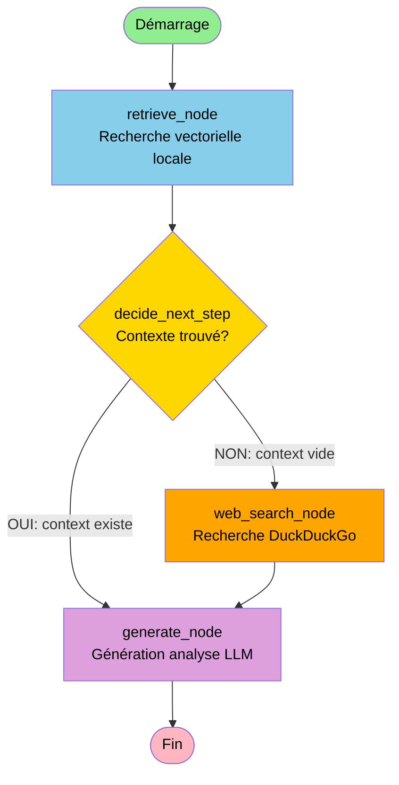

# Explication de l'Agent LangGraph

Voici une explication détaillée de l'agent LangGraph dans ce code :

## Architecture de l'Agent

L'agent utilise **LangGraph** pour créer un workflow décisionnel automatisé qui analyse des produits alimentaires. Voici comment il fonctionne :

### 1. **État de l'Agent (AgentState)**
```python
class AgentState(TypedDict):
    product: str          # Nom du produit à analyser
    context: Optional[str]    # Informations trouvées
    sources: Optional[List[dict]]  # Sources des données
    analysis: Optional[str]   # Analyse générée
```
C'est la "mémoire" partagée entre tous les nœuds du graphe.

### 2. **Les Trois Nœuds Principaux**

- **`retrieve_node`** : Cherche dans la base vectorielle Chroma locale
- **`web_search_node`** : Cherche sur le web via DuckDuckGo si rien n'est trouvé localement
- **`generate_node`** : Génère l'analyse finale avec le LLM

### 3. **Logique Décisionnelle**
```python
def decide_next_step(state: AgentState):
    if state["context"]:
        return "generate"  # Si données trouvées → analyse
    return "web_search"   # Sinon → recherche web
```

### 4. **Flux de Travail**



## Fonctionnement Détaillé

### **Étape 1 : Point d'Entrée**
```python
workflow.set_entry_point("retrieve")
```
Tout commence par une recherche dans la base de données locale (Chroma).

### **Étape 2 : Décision Conditionnelle**
```python
workflow.add_conditional_edges(
    "retrieve",
    decide_next_step,  # Fonction qui décide
    {
        "generate": "generate",      # Si données trouvées
        "web_search": "web_search"   # Si rien trouvé
    }
)
```
C'est la **clé de l'intelligence** : l'agent décide automatiquement s'il a besoin d'aller chercher plus d'informations.

### **Étape 3 : Recherche Web (si nécessaire)**
Si la base locale ne contient pas d'informations, l'agent fait une recherche web automatiquement :
```python
def web_search_node(state: AgentState):
    search = DuckDuckGoSearchRun()
    res = search.run(f"valeurs nutritionnelles {state['product']}")
    return {"context": res, ...}
```

### **Étape 4 : Génération de l'Analyse**
Peu importe d'où viennent les données (local ou web), elles sont envoyées au LLM pour analyse :
```python
def generate_node(state: AgentState):
    prompt = ChatPromptTemplate.from_messages([
        ("system", "Tu es un expert nutritionnel..."),
        ("user", "Produit: {product}\nInfo:\n{context}")
    ])
    chain = prompt | llm | StrOutputParser()
    return {"analysis": chain.invoke(...)}
```

## Avantages de cette Architecture

✅ **Autonome** : L'agent décide lui-même où chercher les informations  
✅ **Résilient** : Si la base locale échoue, il passe au web automatiquement  
✅ **Traçable** : Toutes les sources sont enregistrées dans `state["sources"]`  
✅ **Modulaire** : Facile d'ajouter de nouveaux nœuds (ex: API nutritionnelle)

## Utilisation dans l'Application

Quand un utilisateur télécharge une image de produit :
1. Vision LLM extrait le nom du produit
2. L'agent LangGraph est invoqué : `app_flow.invoke({"product": product_name})`
3. Le workflow s'exécute automatiquement selon le schéma ci-dessus
4. Le résultat contient l'analyse et les sources

Cet agent illustre parfaitement le concept de **RAG augmenté** (Retrieval-Augmented Generation) avec une couche de décision intelligente !